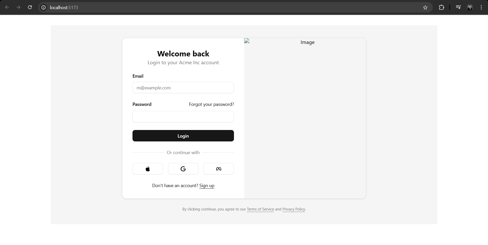
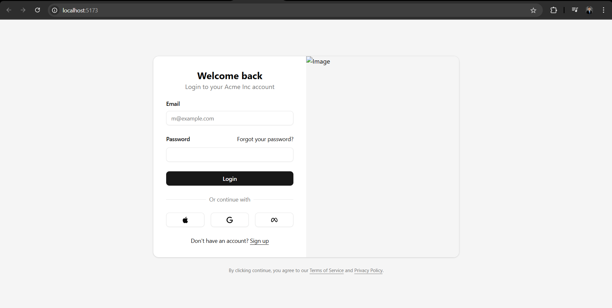

# Project Documentation - Development Log

**Description:** This document tracks the daily progress of the project, focusing on the development process, learning experiences, and troubleshooting. It includes detailed notes on implementation steps, challenges encountered, and solutions found.

**Definitions:**

- **Project** - Disaster Mapping System: This is the system we developed during our Capstone Project 2. It is a full-stack web application designed for offline use. I will be rebuilding this project with a focus on the frontend.

## Development Logs

### April 11, 2025

**Task 1. Choose a Hosting Platform**

**Description:** Our Capstone project originally utilized PHP and MySQL for backend integration, and we deployed our website on webhost000. Unfortunately, due to inactivity on my webhost000 account, the website was removed, and I can no longer retrieve the files. Fortunately, I have backup files available.

**Output:** I tested deploying the website on Heroku App to integrate the backend and found that using Dynos incurs a cost of $0.10 per hour. Since this project is solely for my portfolio, I am looking for a completely free hosting platform. I also explored other hosting options but realized that I would need to spend time understanding their documentation. Given that I am currently focusing on frontend development, I will set aside the backend for now and concentrate on building the frontend from scratch.

**Decision:** Use Github Pages. It's free, easy to setup, and suitable for static website.

**Task Duration:** 20 mins.

---

### April 12, 2025

**Task 2. Identify technologies to use for rebuilding my project**

**Description:** I have experience building static websites using HTML, CSS, JavaScript, and React (installed via Vite). However, I'm eager to explore other modern technologies to further enhance my skills while reworking this project.

**Output:** I watched a TikTok live session featuring an experienced coder who uses Shadcn components to speed up his development process. After reviewing the Shadcn documentation, I found a wide range of UI components available for this project. The documentation is clear and offers various options for installation and usage. I noticed that the default installation includes TypeScript. Since I am familiar with TypeScript and many developers in the JavaScript ecosystem (based on social media platforms like Reddit, Facebook, and TikTok) recommend using it, I will give it a try.

**Decision:**

- Languages: HTML5, CSS3, JavaScript (ES6+), TypeScript
- Technologies: React.js, Tailwind CSS, Vite, npm, Git, GitHub

**Task Duration:** 26 mins.

---

**Task 3. Install and Configure Shadcn/UI for Vite**

**Description:** The Shadcn installation documentation provides a project creation template for React + TypeScript and Tailwind CSS. Follow the installation guide available at https://ui.shadcn.com/docs/installation/vite.

**Output:** A project template featuring React, TypeScript, and Tailwind CSS, along with a successful installation of Shadcn and the addition of the `login-04` component as the initial component.

**Decision:** Given my successful utilization of Shadcn, I am confident in my ability to work effectively on this project.

**Task Duration:** 30 mins.

---

### April 13, 2025

**Task 4. Fix `login-04` design**

**Description:** After adding the `login-04` component from Task 3, I noticed that the login form UI is not displaying properly. I need to figure out what is causing this problem.

**Output:**

**First Problem:** I didn't put a parent container for the `login-04`. Without a parent container, the login form may not have defined width and height, leading to unpredictable layout behavior and potential overflow issues. At first, I thought I just needed to paste Shadcn components and it would be all good. However, I learned that it's basic knowledge to put a container. Shadcn assumes users have this fundamental understanding of CSS.

**Second Problem:** The login form container is not occupying the whole screen (see screenshot below).



This is because the height of the container is set to automatic `min-h-auto`, and the width is fixed at `max-width: 1280px;`, with a padding of `padding: 2rem;` in `App.css`. I was curious why Shadcn added a fixed max width in `App.css` for `#root`, and I learned that it's a consideration for larger screens because it helps maintain a consistent layout and prevents content from stretching too wide, which can negatively impact readability.

**Decision:**

**First Problem:** What I did was check the entire code of `login-04` provided in the Shadcn documentation. I learned that there are two divs needed: one parent container and a child container, and then inside it, I would place the `login-04`. This structure is necessary from Shadcn's perspective to ensure proper styling and layout management, allowing for better responsiveness and alignment of the components. After implementing this change, I saw an improvement in the design, specifically in the responsiveness of the login form.

**Second Problem:** I commented out the code below from `App.css` to avoid confusion with CSS that might override my Tailwind design in `App.tsx`:

```
/* #root {
max-width: 1280px;
margin: 0 auto;
padding: 2rem;
text-align: center;
} */
```

After that, I fixed the height and width of the parent div container by changing it to `min-h-screen` and `w-full`, which resolved the problem by ensuring the container takes up the full height and width of the viewport. Additionally, I added `box-border` to include padding and border in the element's total width and height calculations, preventing layout shifts. Below is the fixed `login-04` display.



**Task Duration:** 3 hours and 2 minutes

---

### April 17, 2025

**Task 5: Update and Customize Login Form**

**Description**  
Modify the existing login form sourced from Shadcn (refer to Task 4) by updating the default text, colors, fonts, and other visual components. The goal is to ensure consistency with the original project design while aligning with modern design standards. It is essential to preserve the core aesthetic of the initial implementation.

**What I Did**

- **Understanding Color Theming in Shadcn** (1 hour 14 mins):
  - Explored the use of CSS variables for theming and discovered the ease of implementing dark mode, thanks to the comprehensive documentation provided by Shadcn.
- **Researching Do's and Don'ts with Shadcn** (38 mins):
  - Learned the importance of not modifying node modules to avoid issues with future updates from Shadcn. Emphasized the need to customize only the provided components and to always refer to the documentation.
- **Updating the Login Form** (1 hour 53 mins):
  - Updated the default text, added the Dismap logo and background image where applicable, and removed unnecessary default code from the Shadcn login-04 component.
- **Documenting Changes** (8 mins):
  - Recorded all modifications made to the login form for future reference.

**Initial Design**  


**New Design**  


**Decision**  
The new design enhances the visual hierarchy by prioritizing the login form while using the map image on the right as a subtle background element. This thematic introduction to the application's mapping system improves focus and reduces visual clutter, in contrast to the initial design, which featured a prominent and distracting seal.

**Task Duration**

- **Total Duration:** 3 hours 53 minutes

## Additional Resources

[Optional: Links to relevant resources.]
